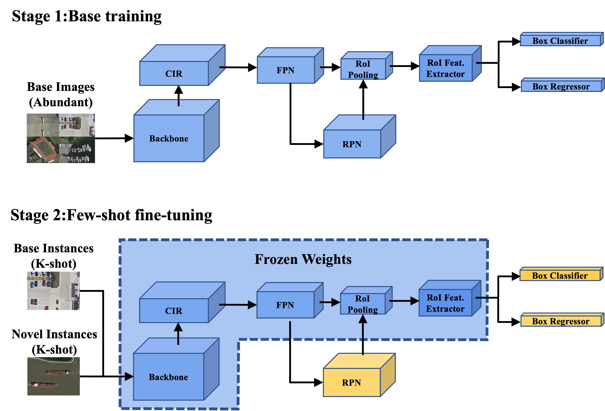

# CIR-FSD Training Instructions

CIR-FSD is trained in two stages. We first train the entire object detector on the data-abundant base classes, and then only fine-tune RPN and the last layers of the detector on a small balanced training set. We provide detailed instructions for each stage.



## Stage 1: Base Training

First train a base model. To train a base model on the first split of PASCAL VOC, run
```angular2html
python tools/train_net.py --num-gpus 2 \
--config-file configs/PASCAL_VOC/base-training/R101_FPN_base_training_split1.yml
```

## Stage 2: Few-Shot Fine-Tuning

### Initialization

After training the base model, run ```tools/ckpt_surgery.py``` to obtain an initialization for the full model. We only modify the weights of the last layer of the detector, while the rest of the network are kept the same. The weights corresponding to the base classes are set as those obtained in the previous stage, and the weights corresponding to the novel classes are either randomly initialized or set as those of a predictor fine-tuned on the novel set.

#### Random Weights

To randomly initialize the weights corresponding to the novel classes, run
```angular2html
python tools/ckpt_surgery.py --src1 checkpoints/s1-0.7-70000-CEM-base/model_final.pth \
--method randinit \
--save-dir checkpoints/s1-0.7-70000-CEM-base

```
The resulting weights will be saved to `checkpoints/s1-0.7-70000-CEM-base/model_reset_surgery.pth`.


### Fine-Tuning

We will then fine-tune the last layer of the full model on a balanced dataset by running
```angular2html
cp configs/PascalVOC-detection/split1/faster_rcnn_R_101_FPN_ft_all1_1shot-CIR-FRPN.yml \
configs/PascalVOC-detection/split1/faster_rcnn_R_101_FPN_ft_all1_1shot.yml 

python tools/run_experiments.py --num-gpus 2 --shots 5 10 20 --seeds 1 11 --split 1 --lr 0.005
```

You should define each training parameter carefully ```in run_experiments.py ``` and ``` faster_rcnn_R_101_FPN_ft_all1_1shot.yml ```,
where `WEIGHTS_PATH` in faster_rcnn_R_101_FPN_ft_all1_1shot.yml is the path to the weights obtained in the previous initialization step.
